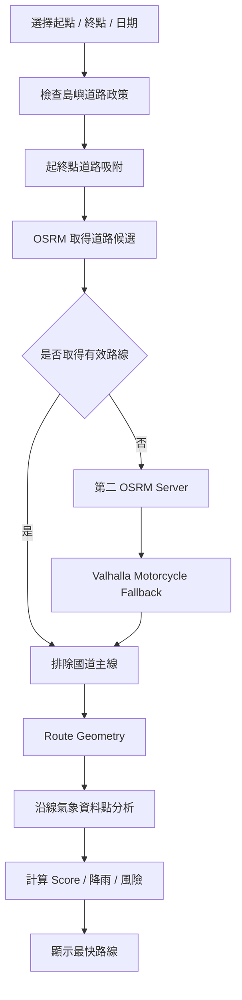
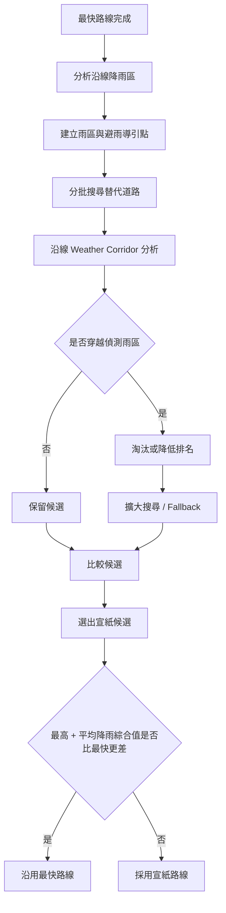
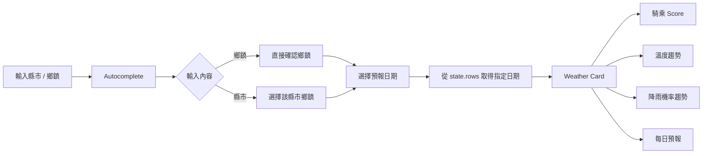

# RideSky｜騎士天際

> **全台氣象資訊 × 機車騎乘條件分析 × GIS 路線決策**
>
> RideSky 是一個以「騎士實際出發決策」為核心的 AIoT-DA 課程專案。系統將中央氣象署鄉鎮預報、SQLite 資料驗證、GIS 地圖、道路路由與騎乘條件評分整合成一個 Web App，讓使用者不只看到「哪裡會下雨」，還能進一步判斷「現在適不適合騎」、「沿途哪裡風險較高」以及「是否值得為了避雨繞路」。

---

## 🔗 Live View

**RideSky 線上網站：**  
([LiveViewPic.png]([url](https://20260923-hw-taiwan-weather.vercel.app/)))
https://20260923-hw-taiwan-weather.vercel.app/

> 本專案部署於 Vercel。氣象資料在建置階段由中央氣象署 API 取得、驗證並寫入 SQLite，部署後由 Serverless API 以唯讀方式提供給前端。

---

## 📌 專案基本資訊

| 項目 | 說明 |
| --- | --- |
| 專案名稱 | **RideSky｜騎士天際** |
| 專案類型 | AIoT-DA HW1 / Web GIS Prototype |
| 核心目標 | 將氣象資料轉換為「可供機車騎士做決策」的資訊 |
| 主要使用者 | 台灣機車騎士、通勤族、旅遊／長途騎乘者 |
| 地理範圍 | 台灣 22 縣市、368 鄉鎮市區 |
| 氣象資料 | 中央氣象署 CWA 鄉鎮未來一週預報 |
| 資料庫 | SQLite |
| 前端 | HTML5 / CSS3 / Vanilla JavaScript |
| GIS | Leaflet + MapLibre GL + CARTO Vector Basemap |
| 路由 | OSRM + Valhalla fallback |
| 部署 | GitHub + Vercel |
| 後端介面 | Vercel Serverless Function：`/api/weather` |
| 時區基準 | Asia/Taipei |
| 專案定位 | Prototype / 決策輔助，不取代官方天氣與道路安全資訊 |

### 課程學習重點對照

延伸自課程「回顧與重點整理」中的實作目標：

- ✅ **API 資料取得**：串接中央氣象署 Open Data。
- ✅ **JSON 資料分析**：解析多層鄉鎮氣象資料與不同預報時間。
- ✅ **SQLite 資料庫**：建立 Schema、資料驗證、JOIN 與資料完整性檢查。
- ✅ **Web App**：本專案採用原生 HTML / CSS / JavaScript + Vercel，而非 Streamlit。
- ✅ **AI × Coding 實作流程**：以 AI 輔助需求拆解、除錯、效能分析與迭代開發。

---

## 🎯 專案動機與問題定義

一般天氣網站多半回答：

> 「某個地方今天幾度？會不會下雨？」

但騎士真正需要回答的問題通常是：

> 「我現在適不適合騎？」  
> 「從 A 到 B 的沿途會不會遇到雨？」  
> 「如果有雨，能不能繞掉？」  
> 「繞路真的比較不容易淋雨，還是只是多花時間？」

因此 RideSky 將氣象資料從「查詢資訊」進一步轉換為「騎乘決策資訊」，把 **降雨、濕度、風速、天氣現象、道路路線與空間位置**放在同一個分析流程中。

---

# 🌐 網頁內容完整介紹

## 1. 全台騎乘氣象資訊

網站讀取全台 368 鄉鎮的預報資料，並整理：

- 溫度
- 相對濕度
- 降雨機率
- 天氣現象
- 風向
- 風速
- 騎乘條件 Score
- 雨具建議
- 高溫／低溫提醒

騎乘適合度滿分為 **5 分**，分數越高代表氣象條件越適合一般機車騎乘。主要評估降雨風險、風速與濕度；溫度不直接扣分，但極端高低溫會另外提醒。

### Score 分級

| Score | 等級 | 說明 |
| ---: | --- | --- |
| 4–5 | 🟢 良好 | 整體適合一般騎乘 |
| 3 | 🟡 普通 | 可騎乘，但仍需留意環境 |
| 2 | 🟠 需注意 | 建議降低速度、重新確認天氣 |
| 0–1 | 🔴 高風險 | 降雨／風勢等條件較不利 |

---

## 2. 搜尋縣市／鄉鎮

使用者可輸入：

- 縣市，例如「台中」
- 鄉鎮，例如「北屯」、「七堵」

搜尋支援鍵盤操作、方向鍵選擇、Enter 確認，以及縣市 → 鄉鎮 → 預報日期的操作流程。

查詢後會顯示指定日期的完整 Weather Card，並可展開未來預報與氣象趨勢。

---

## 3. 預設地區

使用者可設定最多 **9 個預設地區**。

預設地區會同步顯示於：

- 天氣卡片
- GIS 地圖 Marker
- 騎乘條件顏色

設定儲存於瀏覽器 localStorage，不需要帳號登入。

---

## 4. 騎乘氣象資訊地圖

GIS 地圖以深色 RideSky 視覺風格呈現，預設地區會以不同騎乘條件顏色標記。

Marker 色彩：

- 🟢 良好
- 🟡 普通
- 🟠 需注意
- 🔴 高風險

點擊 Marker 可查看該地的氣象與騎乘資訊。

---

## 5. 騎途雷達

「騎途雷達」是 RideSky 的核心路線分析功能。

使用者設定：

1. 起點
2. 終點
3. 預報日期

系統會搜尋道路路線、排除國道主線，並將路線沿線的氣象資料納入分析。

結果包含：

- 道路距離
- 預估車程
- 沿線最差 Score
- 沿線平均 Score
- 沿線最高降雨機率
- 沿線平均降雨機率
- 最需注意的路段
- 沿線氣象資料點
- 可展開的完整 Weather Card
- 最快路線
- 宣紙模式

---

# 🔄 系統資料流程

```mermaid
flowchart TD
    A[中央氣象署 CWA Open Data] --> B[Node.js Build Script]
    B --> C[JSON 解析與欄位正規化]
    C --> D{資料驗證}
    D -->|通過| E[(SQLite weather.db)]
    D -->|失敗| X[Build Fail / 阻止錯誤資料部署]

    E --> F[/api/weather Serverless Function]
    F --> G[SQL JOIN / 日期篩選]
    G --> H[JSON Response]

    H --> I[RideSky Frontend]
    I --> J[Weather Cards]
    I --> K[GIS Map]
    I --> L[騎乘條件 Score]
    I --> M[騎途雷達 Route Analysis]

    M --> N[OSRM / Valhalla]
    N --> O[道路候選]
    O --> P[沿線氣象分析]
    P --> Q[最快路線 / 宣紙模式]
```

### 資料架構核心原則

RideSky **不讓前端直接使用 CWA 原始 API 資料**。

而是採用：

```text
CWA
 ↓
JSON Parsing
 ↓
Validation
 ↓
SQLite
 ↓
/api/weather
 ↓
Frontend
```

這樣做的優點：

1. 可在資料進入網站前先驗證。
2. 前端不需要知道 CWA 原始資料格式。
3. API Key 不會暴露在瀏覽器。
4. 可以使用 SQL 做完整性與合理性檢查。
5. 資料結構更穩定，後續更容易擴充分析功能。

---

# 🗺️ 找尋路線說明與流程

## 最快路線

最快路線的目標是：

> **在排除國道主線的前提下，以預估時間較短的可用道路路線為優先。**



### 路由容錯策略

RideSky 並非只依賴單一路由服務：

1. **OSRM Project Server**
2. **OpenStreetMap.de OSRM**
3. **Valhalla Motorcycle Routing** 作為 fallback
4. 特殊地區會使用道路吸附、導引點與替代路線搜尋
5. 所有候選仍會經 RideSky 自己的國道主線檢查

路由請求支援 AbortController。使用者按下「清除」後，系統會真正取消尚未完成的路由請求，避免背景繼續消耗 public routing service。

---

# 🌂 宣紙模式

宣紙模式的設計哲學：

> **「我就是不想淋雨，我有的是時間。」**

它不是單純找第二短路線，而是以「降低沿線降雨風險」為主要目標。

## 宣紙模式流程



## 沿線降雨比較

Route Analysis 會計算：

```text
沿線最高降雨機率
沿線平均降雨機率
```

宣紙模式完成後再計算：

```text
降雨綜合值
= (沿線最高降雨機率 + 沿線平均降雨機率) / 2
```

如果宣紙候選的綜合值 **反而高於最快路線**，代表這次繞路沒有真正改善整體淋雨風險，因此 RideSky 會直接沿用最快路線。

例如：

```text
最快路線：
最高降雨 70%
平均降雨 30%
綜合值 = 50%

宣紙候選：
最高降雨 60%
平均降雨 50%
綜合值 = 55%

55% > 50%
→ 宣紙候選整體降雨風險沒有改善
→ 沿用最快路線
```

這個設計避免出現：

> 為了避開一個高降雨點，結果繞進一段更長、平均更容易下雨的道路。

### 宣紙模式目前的限制

目前雨區判定仍主要以鄉鎮氣象代表點、道路中心線距離與雨區 buffer 進行分析，尚未使用完整行政區 Polygon 做精準交集。

因此本功能定位為 **Prototype Decision Support**，不是官方道路安全導航。

---

# 🔎 找該地天氣說明與流程



### 預報日期處理

日期統一以 **Asia/Taipei** 處理。

網站不使用「資料庫裡最後 7 天」直接當作今天起的 7 天，而是：

1. 找出台灣本地今日。
2. 從今日開始選取仍有效的預報日期。
3. 最多顯示 7 天。
4. 若 CWA 某次更新只提供今日起 5～6 個有效日曆日，網站仍顯示實際可用日期，而不是讓整支 API 回 500。

---

# 🧰 使用套件

| 套件 / Library | 用途 |
| --- | --- |
| **better-sqlite3** | Node.js 存取 SQLite、資料建置與 Serverless Query |
| **Leaflet 1.9.4** | GIS 地圖容器、Marker、Popup、Polyline |
| **MapLibre GL JS 5.12** | CARTO Vector Basemap 渲染 |
| **maplibre-gl-leaflet** | 將 MapLibre Vector Layer 整合進 Leaflet |
| **CARTO Vector Basemap** | RideSky GIS 底圖 |
| **OpenStreetMap Data** | 地圖與道路網路基礎資料 |
| **OSRM** | 道路路由、Nearest Road Snap、Alternative Route |
| **Valhalla** | Motorcycle routing fallback |

> 前端沒有使用 React / Vue / Angular，核心互動邏輯以 Vanilla JavaScript 實作。

---

# 🧑‍💻 使用技術

### Frontend

- HTML5
- CSS3
- Vanilla JavaScript / ES6+
- Responsive Web Design
- DOM / Event Handling
- localStorage
- SVG Data Visualization
- IntersectionObserver
- AbortController
- requestAnimationFrame
- requestIdleCallback
- Intl.DateTimeFormat

### Backend / Data

- Node.js
- Vercel Serverless Function
- SQLite
- SQL JOIN
- 資料範圍驗證
- Foreign Key Integrity
- Build-time Data Pipeline
- JSON Parsing / Normalization

### GIS / Routing

- Leaflet
- MapLibre GL
- CARTO Vector Tiles
- OpenStreetMap Road Network
- OSRM Routing
- Valhalla Motorcycle Routing
- Polyline / GeoJSON Geometry
- Route Sampling
- Weather Corridor Spatial Analysis

### DevOps

- Git / GitHub
- Vercel
- Environment Variables
- Build Script
- CDN Assets
- Browser Cache / localStorage Cache

---

# 🔌 使用的 API / 外部資料

| 服務 | 用途 | 說明 |
| --- | --- | --- |
| **中央氣象署 CWA Open Data** | 全台鄉鎮氣象 | 取得溫度、濕度、降雨機率、風向、風速、天氣現象與未來預報 |
| **RideSky /api/weather** | 前端氣象 API | 從 SQLite 讀取已驗證資料，不直接暴露 CWA Key |
| **CARTO Basemap API** | Vector Map Style / Tiles | 產生 RideSky 深色 GIS 底圖 |
| **OSRM Project** | 道路路由 | 最快路線與宣紙候選搜尋 |
| **routing.openstreetmap.de** | OSRM fallback | 第一服務不可用時的道路候選來源 |
| **Valhalla OSM.de** | Motorcycle fallback | 特殊路由失敗時的備援 |
| **交通部公路局道路政策資料** | 路線政策 | 用於 RideSky 國道／快速道路政策規則參考 |

### Environment Variables

```text
CWA_API_KEY
CARTO_API_KEY
```

API Key 不會直接寫入 GitHub 或前端原始碼。

---

# 📊 使用的資料視覺化

RideSky 的視覺化不只是「畫圖」，而是讓使用者快速理解騎乘決策。

## GIS Visualization

- 騎乘條件 Marker
- 氣象 Popup
- 起點／終點 Marker
- Route Polyline
- 路線動畫
- 深色 Vector Basemap
- 漸進式地圖細節顯示

## Weather Visualization

- Weather Card
- Score Ring
- 騎乘條件色彩
- 未來每日預報
- 溫度折線圖
- 降雨機率折線圖
- 高低溫提醒
- 雨具建議

### 趨勢圖

目前：

- 溫度圖：最多 7 日
- 降雨機率圖：聚焦前 4 日

降雨圖刻意縮短至 4 日，是因為越遠期的降雨預測變動性通常越高；RideSky 將較近日期作為騎乘決策重點。

---

# 🗄️ SQLite 資料庫設計

資料庫：`database/weather.db`

Schema：`database/schema.sql`

SQL 驗證：`database/queries.sql`

## locations

儲存：

- city
- town
- latitude
- longitude

## weather_forecasts

儲存：

- location_id
- forecast_time
- temperature
- humidity
- precipitation_probability
- weather
- wind_direction
- wind_speed
- source

## ingestion_logs

紀錄：

- 資料來源
- 鄉鎮數量
- Forecast Count
- Valid / Invalid Count
- Ingestion Status
- Validation Message

### 驗證項目

- 368 鄉鎮數量
- 經緯度合理範圍
- 溫度合理範圍
- 濕度 0–100%
- 降雨機率 0–100%
- 風速合理範圍
- Foreign Key Integrity
- Orphan Weather Data
- 沒有預報資料的 Location
- Forecast Date Coverage

---

# ⚡ 過程中的重點修改與技術演進

| 初期方案 / 問題 | 後續調整 | 改善 |
| --- | --- | --- |
| Windy 作為主要氣象來源 | 改採 **中央氣象署 CWA Open Data** | 台灣鄉鎮資料更完整、官方資料來源更清楚 |
| 前端直接使用 API | 改成 **CWA → SQLite → /api/weather → Frontend** | API Key 隔離、資料先驗證、前端結構穩定 |
| 單純顯示天氣 | 加入 **騎乘 Score / 雨具建議 / Route Analysis** | 從資料展示升級成騎乘決策系統 |
| Raster / GIS 底圖反覆載入 | 改成 **CARTO Vector + MapLibre** | 更符合 RideSky 視覺風格，也能控制圖層細節 |
| 地圖一次載入大量細節 | 加入 **Lazy Load + Style Cache + Progressive Vector Style** | 初始地圖載入負擔下降 |
| 固定少量 Route Sampling | 加入 **Route Sampling + ±6 km Weather Corridor** | 降低道路經過鄉鎮卻沒有被氣象點捕捉的情況 |
| 單一路由服務 | OSRM 雙服務 + Valhalla fallback | 提高特殊地區與服務失敗時的容錯能力 |
| 一次並行大量宣紙候選 | 改成 **分階段、小批次搜尋** | 降低 public routing API timeout / 429 風險 |
| 路由搜尋無法真正停止 | 加入 **AbortController / Search Generation Token** | 清除後可取消正在進行的 HTTP Request |
| 每次 Route 重算沿線氣象 | 加入分析快取與 Geometry 預篩概念 | 降低重複運算量 |
| 宣紙只看單一降雨風險 | 加入 **最高降雨 + 平均降雨最終比較** | 避免繞路後整體淋雨機率反而更高 |
| 預報 API 硬性要求今日起完整 7 天 | 改為 **今日起實際可用日期，最多 7 天** | 避免 CWA 更新時段造成網站整體 500 |
| 搜尋主要依滑鼠 | 加入鍵盤操作、Enter、方向鍵與中文輸入法處理 | 提升桌面操作效率與可用性 |

---

# 🧱 專案結構

```text
.
├── api/
│   └── weather.js              # Vercel Serverless Weather API
├── database/
│   ├── schema.sql              # SQLite Schema
│   └── queries.sql             # SQL Validation / Query
├── scripts/
│   ├── build-database.js       # CWA → Validation → SQLite
│   └── build-config.js         # Build-time frontend config
├── index.html                  # Main UI
├── style.css                   # RideSky UI / Responsive Design
├── script.js                   # Weather / Search / GIS / Routing Logic
├── map-performance.js          # Map warm-up / cache optimization
├── map-progressive.js          # Progressive vector map detail
├── route-policy.js             # Motorcycle road policy rules
├── route-points.js             # Route point related data
├── package.json
└── vercel.json
```

---

# 🚀 部署流程

```mermaid
flowchart LR
    A[Push to GitHub] --> B[Vercel Build]
    B --> C[build-database.js]
    C --> D[CWA API]
    D --> E[SQLite Validation]
    E --> F[weather.db]
    F --> G[build-config.js]
    G --> H[Vercel Deployment]
    H --> I[/api/weather]
    I --> J[RideSky Web App]
```

Vercel Build：

```bash
npm run build
```

實際執行：

```text
node scripts/build-database.js
node scripts/build-config.js
```

### SQLite 與 Vercel 的定位

目前 SQLite 採用 **Build-time Database**：

- Build 階段取得 CWA
- 建立 SQLite
- 部署後唯讀
- Serverless Function 查詢

此架構很適合課程 Prototype 與 SQL 資料驗證展示。

若進一步發展成正式服務，資料層應改成真正的 Persistent Database。

---

# 🔭 未來展望

## 1. 行政區 Polygon 雨區分析

目前宣紙模式主要使用鄉鎮氣象代表點、Weather Corridor 與距離 Buffer。

未來可整合 NLSC／政府行政區 GeoJSON：

```text
Route Polyline
      ×
Rainy Township Polygon
      ↓
真正的幾何 Intersection
```

可以更精準判斷「道路真的進入該鄉鎮」還是「只是靠近氣象代表點」。

## 2. 自建 Routing Backend

目前使用 public OSRM / Valhalla，可能遇到：

- Rate Limit
- Timeout
- Public Service 不穩定
- Routing Profile 無法完全自訂

未來可自建 OSRM / Valhalla，建立更符合台灣機車的 Routing Profile。

## 3. 即時道路資訊

未來可整合：

- 道路施工
- 封路
- 事故
- 落石
- 積水
- 即時交通速度

讓「氣象可騎」進一步升級成「道路實際可騎」。

## 4. Persistent Weather Database

將 Build-time SQLite 升級成：

- PostgreSQL / PostGIS
- TimescaleDB
- Supabase / Managed PostgreSQL

即可保存歷史預報、實際觀測與模型結果，進一步研究預報誤差。

## 5. AI Agent 個人化騎乘決策

未來可加入使用者偏好，例如：

- 可接受的最大降雨機率
- 是否願意多繞 30 / 60 / 120 分鐘
- 是否怕強風
- 是否偏好山路／市區
- 夜間騎乘限制

讓 Agent 在多個候選方案中自動解釋：

> 「為什麼今天推薦這條路？」

## 6. PWA / Mobile Experience

可加入：

- PWA
- Offline Cache
- 手機桌面捷徑
- 出發前天氣提醒
- Route Weather Alert

讓 RideSky 從課程 Web Prototype 進一步成為真正可使用的騎士工具。

## 7. 自動化測試與監控

建立：

- 368 鄉鎮資料完整性 Test
- Route Regression Test
- API Health Check
- Vercel Deployment Smoke Test
- Routing Service Availability Monitor

降低未來修改功能時造成其他模組回歸錯誤的風險。

---

# ⚠️ 使用限制與聲明

RideSky 為課程與技術 Prototype。

氣象、路由、道路開放政策及第三方服務均可能隨時間變動。網站提供的 Score、宣紙模式與路線分析屬於**決策輔助資訊**，並非中央氣象署、交通主管機關或導航服務的官方安全建議。

實際騎乘前仍應確認：

- 最新氣象警特報
- 道路封閉／施工資訊
- 現場路況
- 法規與道路標誌

---

## 🏁 Summary

RideSky 的核心不是「再做一個天氣網站」，而是建立一條完整的資料與決策鏈：

```text
API 資料取得
→ JSON 解析
→ 資料驗證
→ SQLite
→ Serverless API
→ GIS 視覺化
→ 騎乘條件分析
→ 道路路由
→ 沿線氣象分析
→ 騎乘決策
```

這個專案將課程中的 **API、JSON、SQLite、Web App 與 AI × Coding** 串成一個具有明確使用情境的完整系統，並以「騎士能不能更快理解風險、做出更合理的出發決策」作為最終設計目標。
